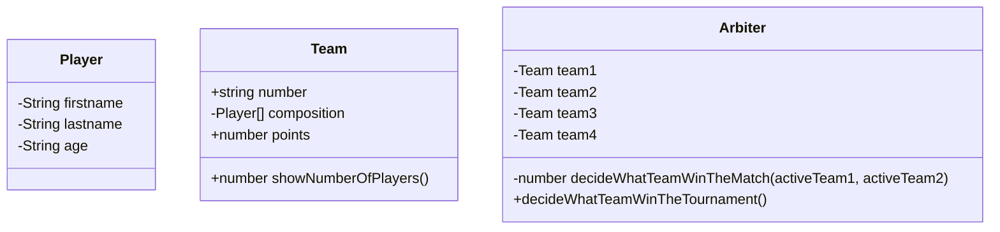

```mermaid
classDiagram
    class Player{
        -String firstname
        -String lastname
        -String age
    }

    class Team{
        +string number
        -Player[] composition
        +number points
        +number showNumberOfPlayers()
    }

    class Arbiter{
        -Team team1
        -Team team2
        -Team team3
        -Team team4
        -number decideWhatTeamWinTheMatch(activeTeam1, activeTeam2)
        +decideWhatTeamWinTheTournament()
    }
```

