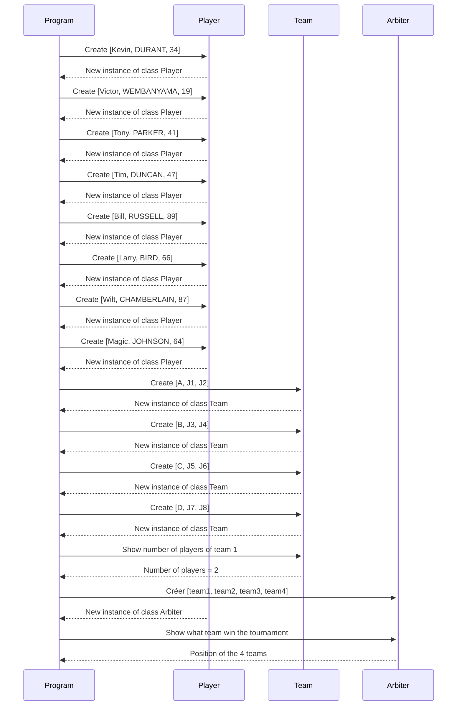

```mermaid
sequenceDiagram
    Program->>+Player: Create [Kevin, DURANT, 34]
    Player-->>Program: New instance of class Player
    Program->>+Player: Create [Victor, WEMBANYAMA, 19]
    Player-->>Program: New instance of class Player

    Program->>+Player: Create [Tony, PARKER, 41]
    Player-->>Program: New instance of class Player
    Program->>+Player: Create [Tim, DUNCAN, 47]
    Player-->>Program: New instance of class Player

    Program->>+Player: Create [Bill, RUSSELL, 89]
    Player-->>Program: New instance of class Player
    Program->>+Player: Create [Larry, BIRD, 66]
    Player-->>Program: New instance of class Player

    Program->>+Player: Create [Wilt, CHAMBERLAIN, 87]
    Player-->>Program: New instance of class Player
    Program->>+Player: Create [Magic, JOHNSON, 64]
    Player-->>Program: New instance of class Player

    Program->>+Team: Create [A, J1, J2]
    Team-->>Program: New instance of class Team
    Program->>+Team: Create [B, J3, J4]
    Team-->>Program: New instance of class Team
    Program->>+Team: Create [C, J5, J6]
    Team-->>Program: New instance of class Team
    Program->>+Team: Create [D, J7, J8]
    Team-->>Program: New instance of class Team

    Program->>+Team: Show number of players of team 1
    Team-->>Program: Number of players = 2

    Program->>+Arbiter: Créer [team1, team2, team3, team4]
    Player-->>Program: New instance of class Arbiter

    Program->>+Arbiter: Show what team win the tournament
    Arbiter-->>Program: Position of the 4 teams
```