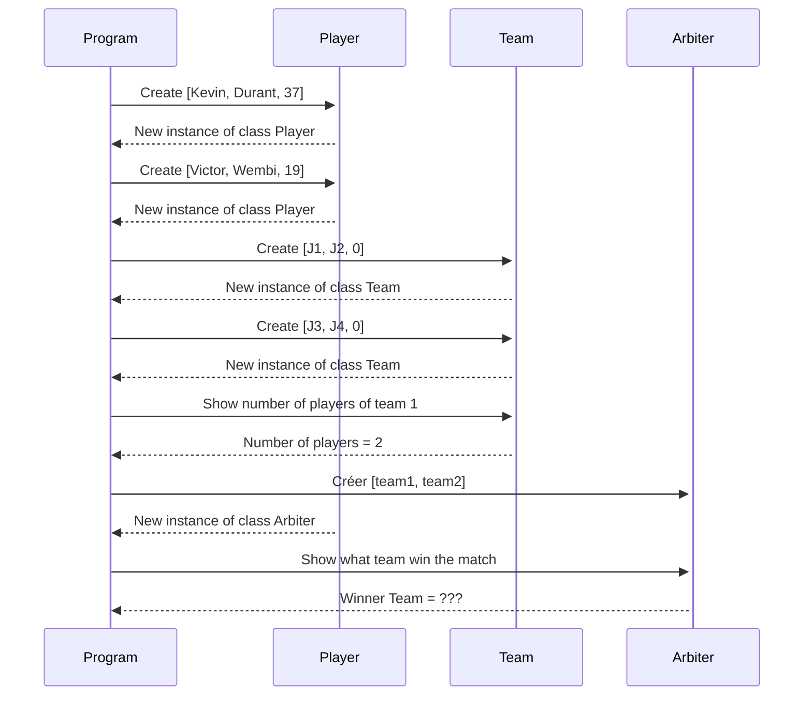

```mermaid
sequenceDiagram
    Program->>+Player: Create [Kevin, Durant, 37]
    Player-->>Program: New instance of class Player
    Program->>+Player: Create [Victor, Wembi, 19]
    Player-->>Program: New instance of class Player

    Program->>+Team: Create [J1, J2, 0]
    Team-->>Program: New instance of class Team
    Program->>+Team: Create [J3, J4, 0]
    Team-->>Program: New instance of class Team

    Program->>+Team: Show number of players of team 1
    Team-->>Program: Number of players = 2

    Program->>+Arbiter: Créer [team1, team2]
    Player-->>Program: New instance of class Arbiter

    Program->>+Arbiter: Show what team win the match
    Arbiter-->>Program: Winner Team = ???
```