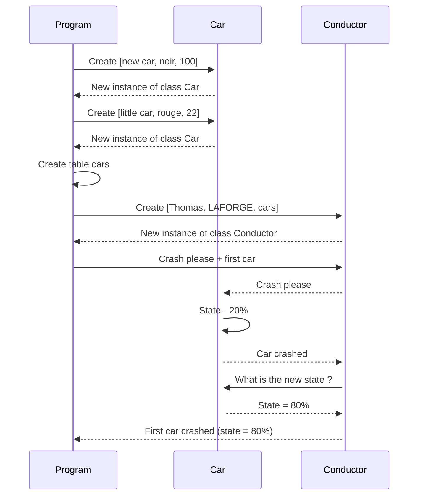

```mermaid
sequenceDiagram
        Program->>+Car: Create [new car, noir, 100]
        Car-->>Program: New instance of class Car

        Program->>+Car: Create [little car, rouge, 22]
        Car-->>Program: New instance of class Car

        Program->>Program: Create table cars

        Program->>+Conductor: Create [Thomas, LAFORGE, cars]
        Conductor-->>Program: New instance of class Conductor

        Program->>+Conductor: Crash please + first car
        Conductor-->>Car: Crash please
        Car->>Car: State - 20%
        Car-->>Conductor: Car crashed
        Conductor->>+Car: What is the new state ?
        Car-->>Conductor: State = 80%
        Conductor-->>Program: First car crashed (state = 80%)
```