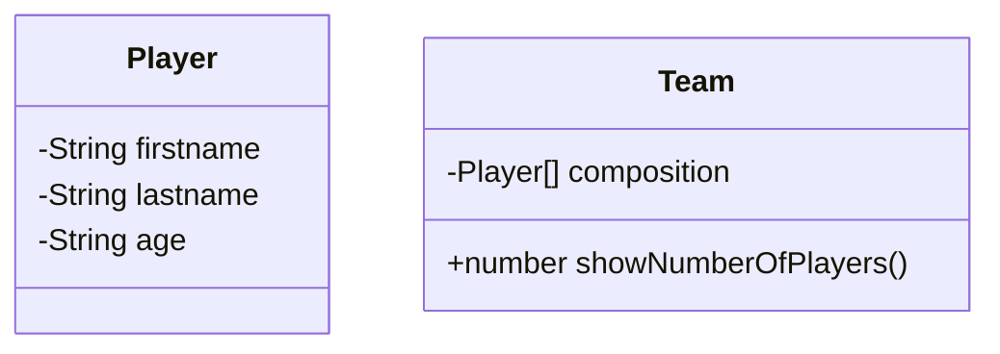

```mermaid
classDiagram
    class Player{
        -String firstname
        -String lastname
        -String age
    }

    class Team{
        -Player[] composition
        +number showNumberOfPlayers()
    }
```

