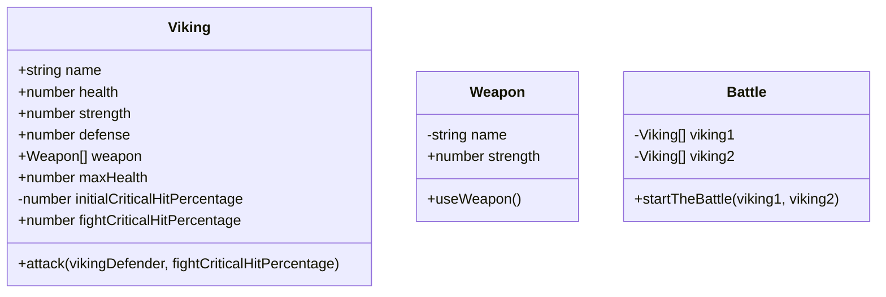

```mermaid
classDiagram
    class Viking{
        +string name
        +number health
        +number strength
        +number defense
        +Weapon[] weapon
        +number maxHealth
        -number initialCriticalHitPercentage
        +number fightCriticalHitPercentage
        +attack(vikingDefender, fightCriticalHitPercentage)
    }

    class Weapon{
        -string name
        +number strength
        +useWeapon()
    }

    class Battle{
        -Viking[] viking1
        -Viking[] viking2
        +startTheBattle(viking1, viking2)
    }
```