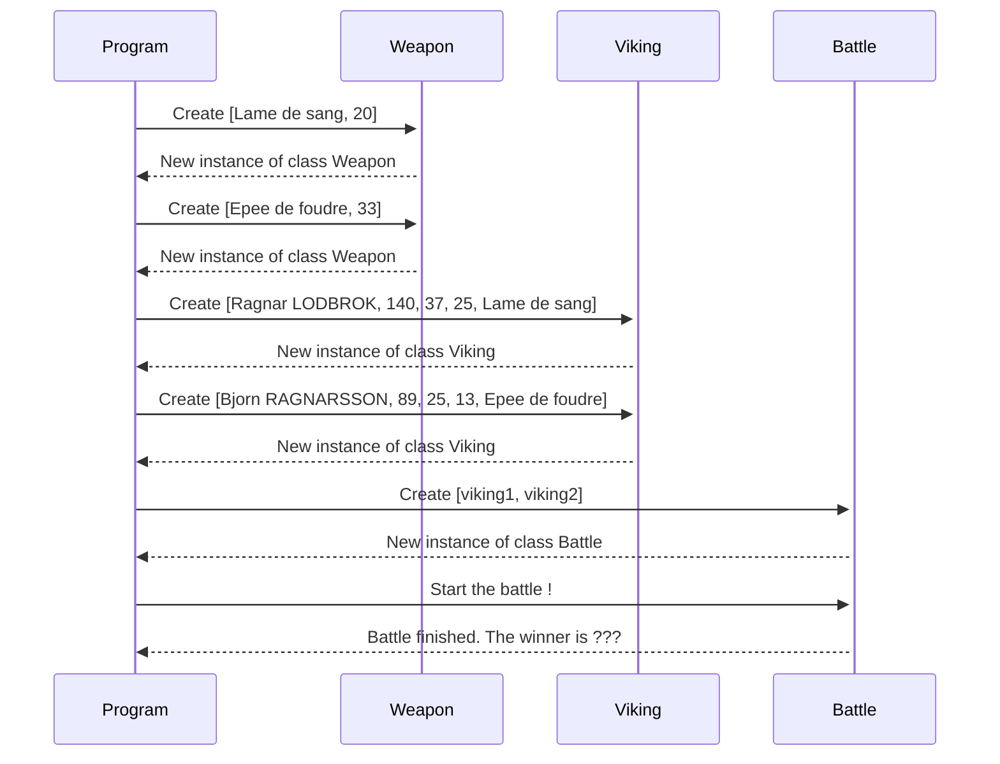

```mermaid
sequenceDiagram
    Program->>+Weapon: Create [Lame de sang, 20]
    Weapon-->>Program: New instance of class Weapon

    Program->>+Weapon: Create [Epee de foudre, 33]
    Weapon-->>Program: New instance of class Weapon

    Program->>+Viking: Create [Ragnar LODBROK, 140, 37, 25, Lame de sang]
    Viking-->>Program: New instance of class Viking

    Program->>+Viking: Create [Bjorn RAGNARSSON, 89, 25, 13, Epee de foudre]
    Viking-->>Program: New instance of class Viking

    Program->>+Battle: Create [viking1, viking2]
    Battle-->>Program: New instance of class Battle

    Program->>+Battle: Start the battle !
    Battle-->>Program: Battle finished. The winner is ???
```